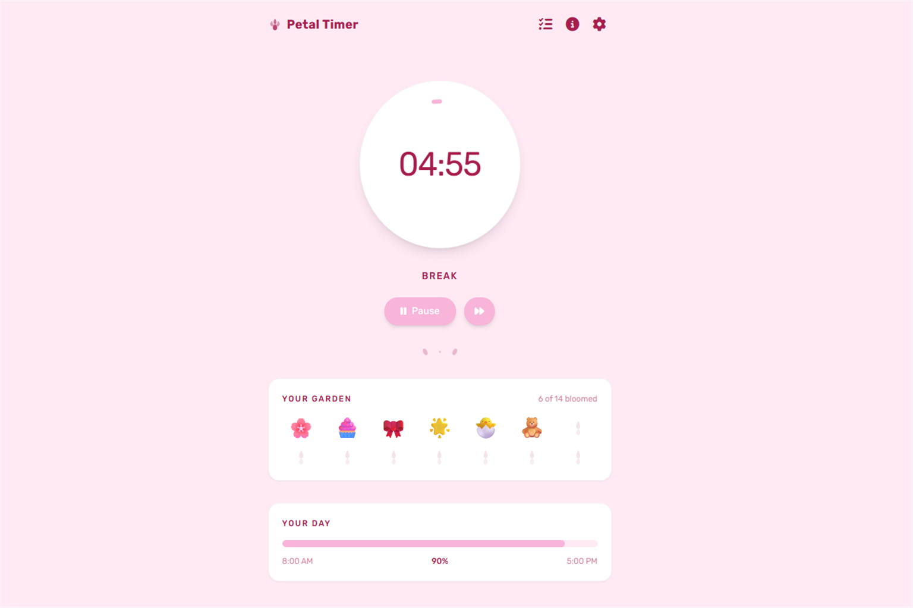

# Petal Timer

[](https://codecov.io/gh/avaj0hnson/petal-timer)

A minimal, customizable Pomodoro timer designed for real 9-to-5 workdays. Stay focused, grow your badge garden, and track your day — all in a soft, cozy aesthetic.

**[Live Demo](https://petaltimer.netlify.app)**



---

## Features

- **Pomodoro Timer** — Configurable work, short break, and long break durations
- **6 Themes** — Blush, Minty Fresh, Sunbeam, Deep Sea, Midnight, and Galaxy
- **Badge Garden** — Earn themed emoji badges for each completed focus session
- **Workday Timeline** — Visual progress bar tracking your 9-to-5 day
- **Task List** — Simple to-do list with completion tracking
- **Sound Notifications** — Audio cues when sessions end (with mute option)
- **Confetti Celebrations** — Confetti burst on each completed focus session
- **Responsive Design** — Works seamlessly on mobile and desktop
- **Privacy First** — All data stays in your browser via `localStorage`, no accounts or tracking

---

## Tech Stack

- [Angular 18](https://angular.io/) — Standalone components with SSR
- [Tailwind CSS 3](https://tailwindcss.com/) — Utility-first styling with custom theme system
- [TypeScript 5.5](https://www.typescriptlang.org/) — Strict mode enabled
- [RxJS](https://rxjs.dev/) — Reactive state management
- [canvas-confetti](https://www.npmjs.com/package/canvas-confetti) — Celebration animations
- [ng-circle-progress](https://www.npmjs.com/package/ng-circle-progress) — Circular timer display
- [Luxon](https://moment.github.io/luxon/) — Timezone-aware date/time
- [ESLint](https://eslint.org/) + [angular-eslint](https://github.com/angular-eslint/angular-eslint) — Code quality

---

## Getting Started

```bash
# Clone the repo
git clone https://github.com/avaj0hnson/petal-timer.git
cd petal-timer

# Install dependencies
npm install

# Start dev server
npm start

# Build for production
npm run build

# Run tests
npm test

# Lint
npm run lint

# Serve SSR build
npm run serve:ssr:petal-timer
```

---

## Project Structure

```text
petal-timer/
├── .github/workflows/         # CI pipeline (tests, coverage, lint)
├── public/                    # Static assets (favicon, sounds, preview)
│   └── sounds/                # Timer notification sounds
├── src/
│   ├── app/
│   │   ├── pages/
│   │   │   └── pomodoro/      # Main timer page
│   │   ├── components/
│   │   │   ├── badge-playground/     # Badge garden display
│   │   │   ├── info-modal/           # About & privacy modal
│   │   │   ├── settings-modal/       # Timer settings modal
│   │   │   ├── skip-confirm-modal/   # Skip confirmation dialog
│   │   │   ├── task-list-modal/      # To-do list modal
│   │   │   └── timeline/             # Workday progress bar
│   │   ├── constants/         # Theme definitions
│   │   ├── models/            # TypeScript interfaces
│   │   └── services/          # Timer, theme, task, sound, badge logic
│   └── styles.scss            # Global styles
├── angular.json               # Angular CLI configuration
├── tailwind.config.js         # Tailwind theme setup
├── eslint.config.js           # ESLint configuration
└── package.json               # Dependencies and scripts
```

---

## Testing

```bash
npm test -- --code-coverage
```

View full coverage on [Codecov](https://app.codecov.io/gh/avaj0hnson/petal-timer).

---

## License

&copy; 2025 Ava Johnson. All rights reserved.
