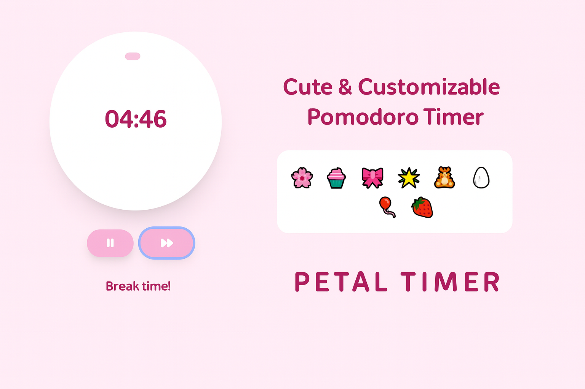

# 🌸 Petal Timer
[](https://codecov.io/gh/avaj0hnson/petal-timer)

A cute and modern Pomodoro timer built for realistic 8–5 workdays — complete with customizable sessions, motivating badges, themeable visuals, and real-time progress tracking. Stay focused, structured, and stylish.



---

## ✨ Features

- ⏱ **Workday-Based Pomodoro Flow**: Aligns with a standard 8–5 schedule.
- 🛠 **Customizable Sessions**: Set your own preferred hours and breaks.
- 📊 **Live Progress Tracker**: See your daily productivity unfold.
- 🌸 **Badges & Confetti**: Earn adorable rewards for every session.
- 🔔 **Sound Alerts**: Gentle reminders to switch between focus and rest.
- 🎨 **Theme Support**: Choose from Blush, Galaxy, Minty Fresh, and more.
- 🌐 **Offline-Ready** – Saves your preferences with local storage.
- 📱 **Responsive Design** – Works seamlessly on mobile and desktop.

---

## 🧱 Tech Stack

- [Angular](https://angular.io/)
- [Tailwind CSS](https://tailwindcss.com/)
- [RxJS](https://rxjs.dev/) & Component Store
- [canvas-confetti](https://www.npmjs.com/package/canvas-confetti)

---

## 🚀 Getting Started

1. Clone the repo  
   ```bash
   git clone https://github.com/avaj0hnson/petal-timer.git
   cd petal-timer
2. Install dependencies
   ```bash
   npm install
3. Run Locally
   ```bash
   ng serve

---

## 📁 Project Structure
```text
petal-timer/
├── .github/               # GitHub Actions workflow for tests and coverage
├── public/                # Static assets (favicon, preview image, robots.txt)
│   ├── sounds/            # Timer sounds
│   └── preview.png        # UI screenshot for README
├── src/                   # Application source code
│   ├── app/               # Core app components and features
│   │   ├── badge-playground/  # Badge unlock and reward system
│   │   ├── constants/         # Theme colors, badge sets, and defaults
│   │   ├── models/            # TypeScript interfaces and enums
│   │   ├── pomodoro/          # Main Pomodoro logic and timer UI
│   │   ├── services/          # Sound, confetti, theme, and timer logic
│   │   ├── settings-modal/    # Session customization modal
│   │   └── timeline/          # Daily timeline and progress tracker
│   ├── app.component.*        # Root component files
│   ├── app.config.ts          # Application configuration
│   ├── app.config.server.ts   # Server-side config (for SSR)
│   ├── index.html             # App entry HTML
│   ├── main.ts                # App bootstrap (client)
│   ├── main.server.ts         # App bootstrap (server)
│   └── styles.scss            # Global styles
├── server.ts              # Server-side rendering entry point
├── karma.conf.js          # Karma test runner config
├── angular.json           # Angular CLI configuration
├── tailwind.config.js     # TailwindCSS theme setup
├── tsconfig*.json         # TypeScript configs
├── package.json           # Project metadata and scripts
└── README.md              # This file 🌸
```

---

## 🧪 Testing

This project includes unit tests for all major components.

```bash
ng test --code-coverage
```

View full coverage on [Codecov](https://app.codecov.io/gh/avaj0hnson/petal-timer)
